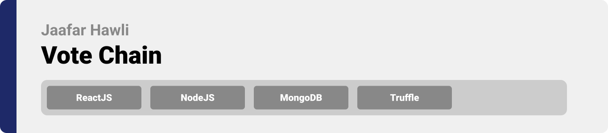

<div align="center">

> Hello world! This is the project’s summary that describes the project plain and simple, limited to the space available. 


**[PROJECT PHILOSOPHY](https://github.com/jaafarhawli/vote-chain#-project-philosophy) • [WIREFRAMES](https://github.com/jaafarhawli/vote-chain#-wireframes) • [TECH STACK](https://github.com/jaafarhawli/vote-chain#-tech-stack) • [IMPLEMENTATION](https://github.com/jaafarhawli/vote-chain#-impplementation) • [HOW TO RUN?](https://github.com/jaafarhawli/vote-chain#-how-to-run)**

</div>

<br><br>


> Vote Chain is a decentralized online voting wesbite that is built to run any election using blockchain. Any user can create an account and launch elections by adding parties, candidates, voters, and moderators in order to help him take control of te election
> 
> When election is launched, voters can access the voting poll after logging in using their generated ID and key sent to them by email, they can then vote for their candidate, deploy the vote on the blockchain, and check statistical results after voting.

### User Stories
- As a user, I want to launch an election in a specific time interval
- As a user, I want to be able to add moderators to my election to help me add voters to the election
- As a user, I want to be able to add my own list of parties and candidates to my election
- As a user, I want to be able to add voters to my election
- As a user, I want to be able to check election statistical data while running the election
- As a user, I want my election to be trusted and run securely without people being able to alter data

### Voter Stories
- As a voter, I want my vote to be delivered without being manipulated by anyone
- As a voter, I want to be able to view all parties and their candidates before voting
- As a voter, I want to see the election statistical live results after voting
- As a voter, I want to keep track of how much time is left for election to start/end

<br><br>


> This design was planned before on paper, then moved to Figma app for the fine details.
Note that I used TailwindCSS as a styling framework

| Landing  | Login  |
| -----------------| -----|
|  |  |

| Admin Elections Page  | Admin Panel  |
| -----------------| -----|
|  |  |

| Moderator Panel  | Voter Landing Page  |
| -----------------| -----|
|  |  |

| Voter Page  | Voting Page  |
| -----------------| -----|
|  |  |


<br><br>


Here's a brief high-level overview of the tech stack the Well app uses:

- This project uses the [React app library](https://reactjs.org/). React makes it painless to create interactive UIs, is component-based and is reusable.
- As database, [MongoDB](https://www.mongodb.com/) was used
- Vote Chain uses Node.js Express framework for backend. [Express](https://expressjs.com/) is a minimal and flexible Node.js web application framework that provides a robust set of features to develop web and mobile applications.
- The project uses solidity for writing smart contracts to blockchain. [Solidity](https://docs.soliditylang.org/en/v0.8.17/) is an object-oriented, high-level language for implementing smart contracts.


<br><br>


> Uing the above mentioned tecch stacks and the wireframes build with figma from the user sotries we have, the implementation of the app is shown as below, these are screenshots from the real app

| Landing  | Login  |
| -----------------| -----|
| .png) | .png) |

| Admin Elections Page  | Admin Panel  |
| -----------------| -----|
| .png) | .png) |

| Moderator Panel  | Voter Landing Page  |
| -----------------| -----|
| .png) | .png) |


<br><br>


To get a local copy up and running follow these simple example steps.

### Prerequisites

This is an example of how to list things you need to use the software and how to install them.
* npm
  ```sh
  npm install npm@latest -g
  ```

### Installation

1. Get a free API Key at [https://example.com](https://example.com)
2. Clone the repo
   ```sh
   git clone https://github.com/jaafarhawli/Vote-Chain.git
   ```
3. Install NPM packages
   ```sh
   npm install
   ```
4. Enter your API in `config.js`
   ```js
   const API_KEY = 'ENTER YOUR API';
   ```


